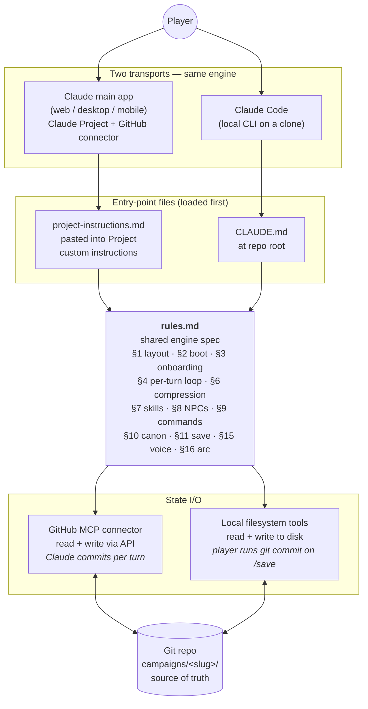
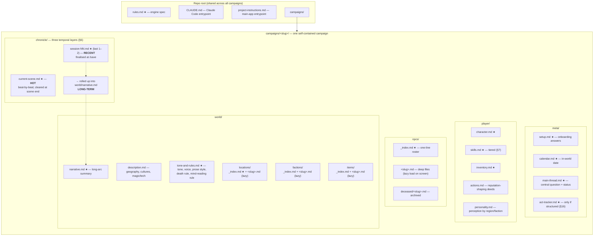
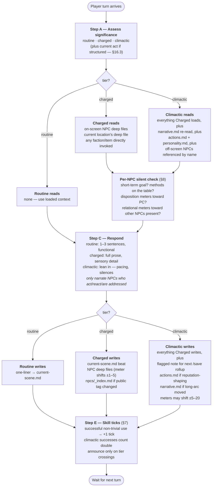

# Narrative Adventure Engine — Architecture

Three views of the engine: the **transports** (how the player reaches Claude), the **repo layout** (how the campaign's durable state is organised), and the **per-turn loop** (what happens each time the player takes an action).

The authoritative spec is [`rules.md`](rules.md); these diagrams are orientation, not contract.

---

## 1. System / transports

The engine ships as a `rules.md` spec at the repo root. Two transports load it via different entrypoint files but converge on the same file-based state in git.

**Key difference between transports:** who writes git history. On the main app Claude commits each turn via the GitHub API; in Claude Code the player commits manually on `/save`. Everything else — the rules, the file shapes, the loops — is identical.

---

## 2. Repo / campaign structure

The repo holds many self-contained campaigns under `campaigns/<slug>/`. Files marked **★** are part of the **boot set** (§2) — read at the start of every fresh chat. Everything else is loaded lazily as entities come on-screen.

**The three temporal layers** map to compression discipline:

- **HOT** (`current-scene.md`) — verbose, ephemeral. Cleared on scene end.
- **RECENT** (`session-NN.md`) — built across a session, summarised on `/save`.
- **LONG-TERM** (`world/narrative.md`, `player/actions.md`) — the story-as-remembered-in-a-decade. Only major beats survive here.

---

## 3. Per-turn loop

The five-step cycle from §4. Significance (routine / charged / climactic) is the dial that controls how much Claude reads, how rich the prose gets, and how much state gets written. Routine is cheap; climactic loads and writes broadly.

**Significance bias is set per scene** but a single turn can escalate (a sudden confession, betrayal, reveal). The player can force the tier with `/routine`, `/charged`, or `/climactic`. In structured campaigns the current act biases the default — Act 1 leans routine/charged, Act 2 defaults to charged, Act 3 biases climactic.

---

## See also

- [`rules.md`](rules.md) — the engine spec (read first)
- [`CLAUDE.md`](CLAUDE.md) — Claude Code session entrypoint
- `project-instructions.md` — main-app session entrypoint
